# 閉店作業
1. 一階中の締め作業
   - **1.1,1.2,1.3は夜のメンバーで協力して行うこと！特に1.2と1.3はなるべく閉店後にしないように余裕のある時間に仕上げること！**
   1.1. レジ締め（レジ点検）

   - タブレットのAirレジ（アプリ）を作動
   
       
   
   - ホームレジ中心の**レジ点検・清算**を押す
   
       
   
   - 上から三番目の**レジ点検・清算**を押す
   
       
   
   - 水色の**点検**を押す
   
       
      
   - 金種別に枚数を記録，過不足０であれば右下の**点検**を押す（問題があれば，風間さん，伊藤さんに相談する）
      
      

   - 日付，現金売り上げの金額，「半弓道場」と書いて売上金を茶封筒に入れる（間違っていた場合は再度確認，レジミスがなかったかを確認する）
   - 過不足金があった場合は日付，過剰金額，「半弓道場」を書いて過剰金を茶封筒に入れる
  
     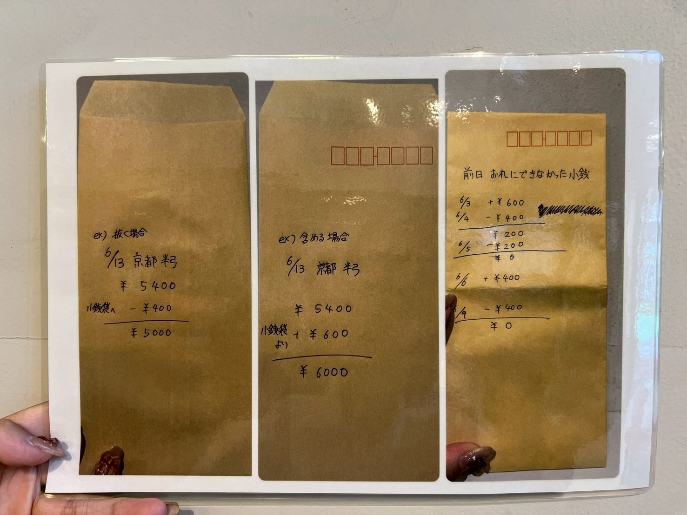
      
   1.2　外と中の片付け

   - 外と中の安土に水をかけ，鏝（コテ）で地面を綺麗に均す（ならす）
   - 下の方に土が溜まりやすいので，定期的に鏝（コテ）やスコップで土を上にあげる
   - 外の土にトタンをかける
     
     
   - 外の電気を消す(自販機そばのコンセントを抜く）
     
     
     
   - 使った的をテナント内に持ち込む
     
   - 安土側の電気を消す！（忘れやすいのでここのタイミングで消すこと）
     
      
     
   -ベンチや椅子，看板の片づけ
   
      - 椅子と白いboxはテナント内に片づける
        
　　　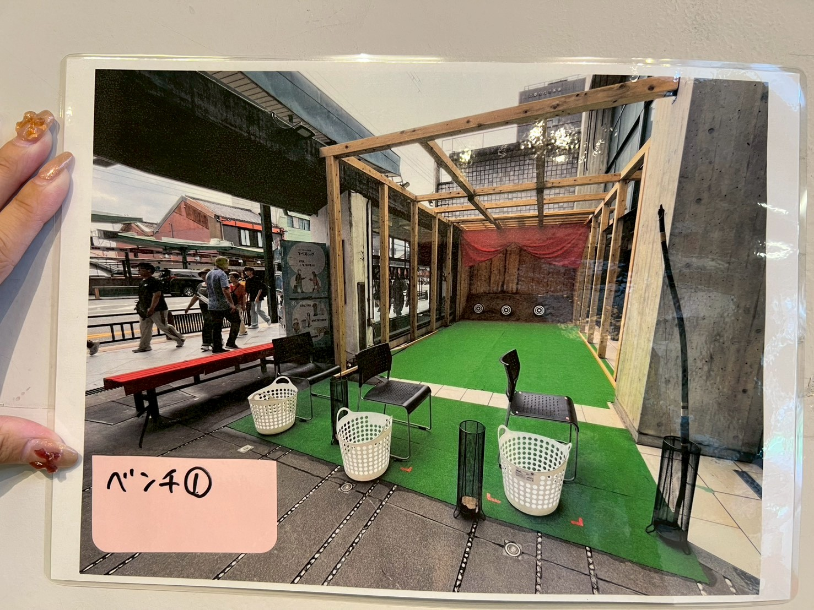
   
   - ベンチは写真のように片づける
        
   
      
   1.3 ２階の片付け，的や矢の整備
   - 1階同様安土の水かけと鏝（コテ）で均す（ならす）作業をする
   - ボタンで押せる蛍光灯を全て消す
     
     
   - 階段のシャッターを閉める(**シャッター付近に人がいないことを確認すること！**）
     
     
     
   - 穴の空いた的を１階に持っていく

   
  1.4 的，弓，矢の整備
  
   - 交換する必要のある的，弓（握り皮），矢（シール）の張り替えを行う

2. お店を閉める

   2.1. 鍵の入手
   - 鍵を入手
   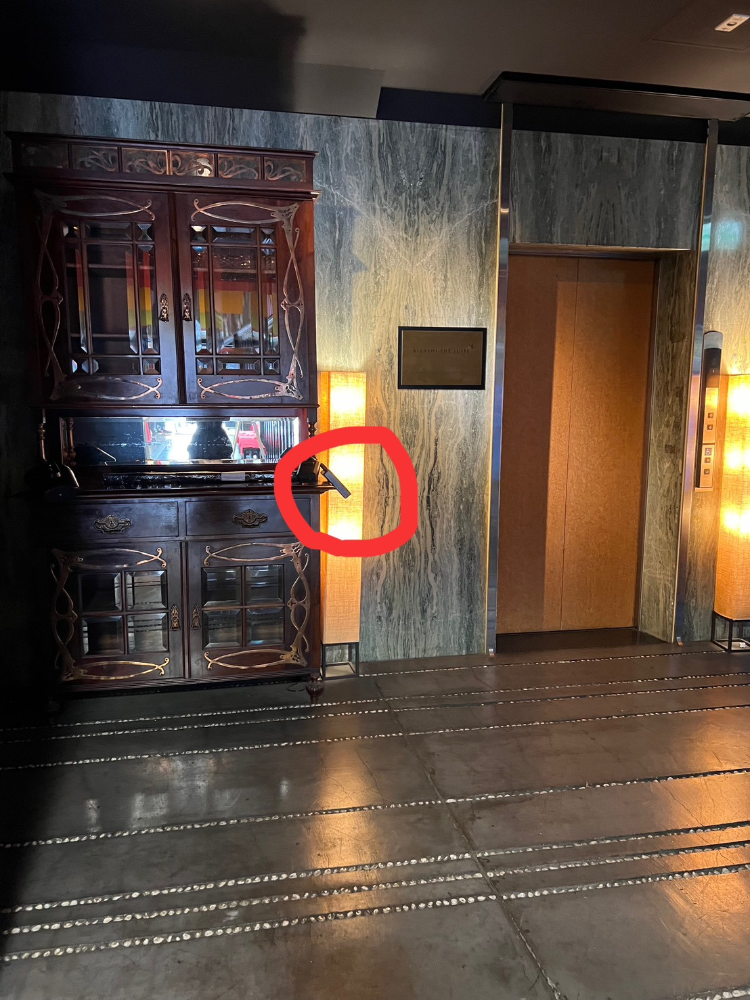
   
    - ダイヤルは**1,2,3,4**に設定する．
     
   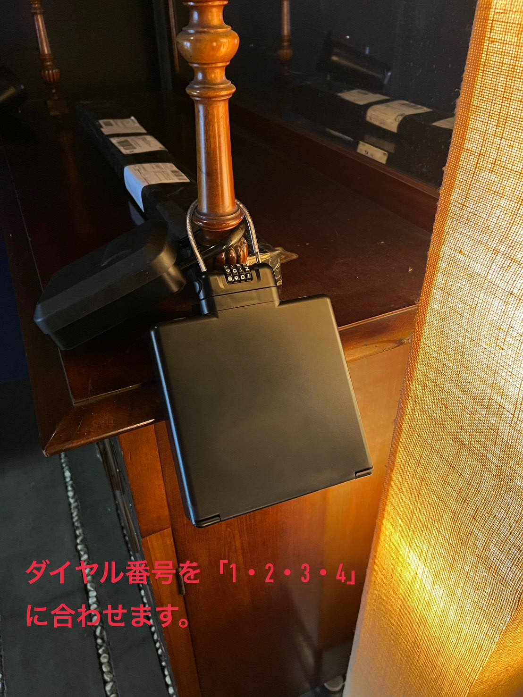
   
   
   
   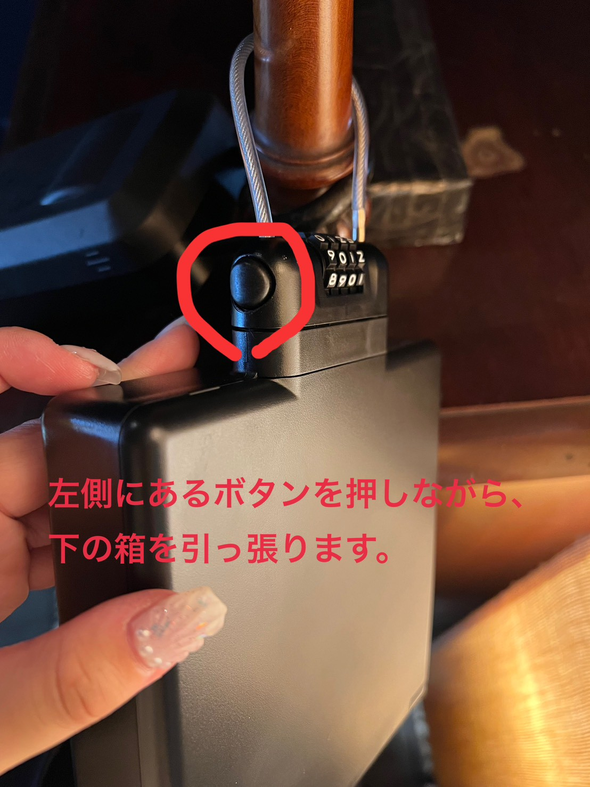

　　- 写真の鍵とカードを入手
   　
   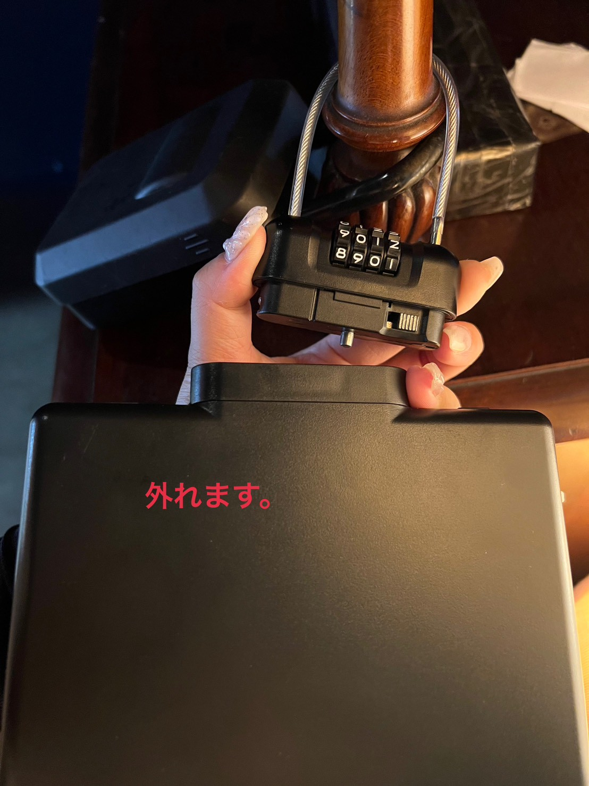
   
   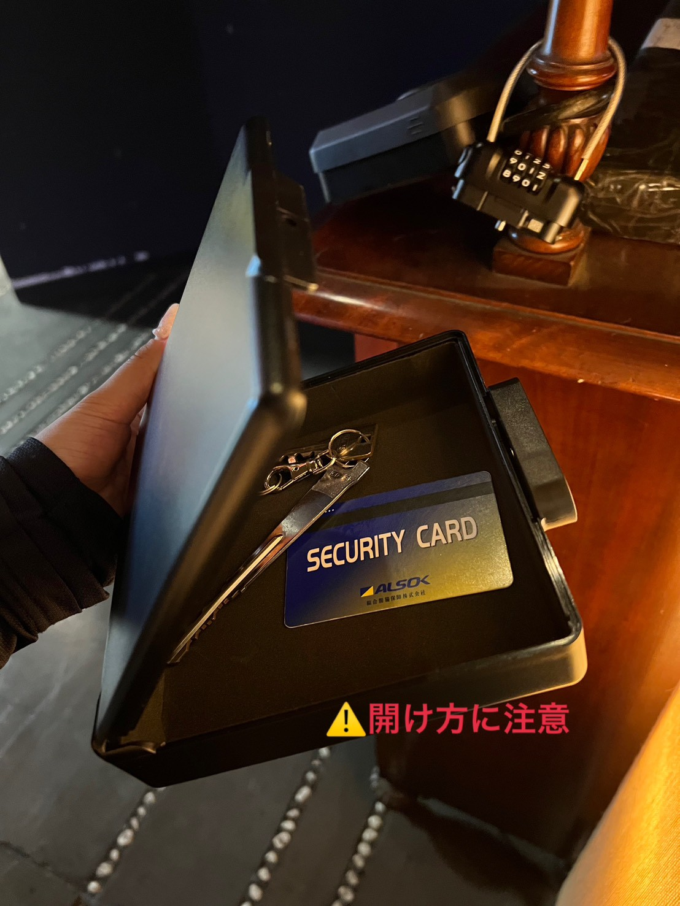　　
   
   
   2.2. テナントをしめる（めっちゃ大事！！！）
   
   - 写真の形になるようにテナントをしめる
     
     
   
   - テナントの鍵を閉める(鍵は2.1の場所に載ってます）
  
     
   
   2.3  照明・音楽・空調を消す
   
   - エレベーター右側の通路から写真の該当の箇所の電源をOFFにする．
   
   - 電気を消す場所

   　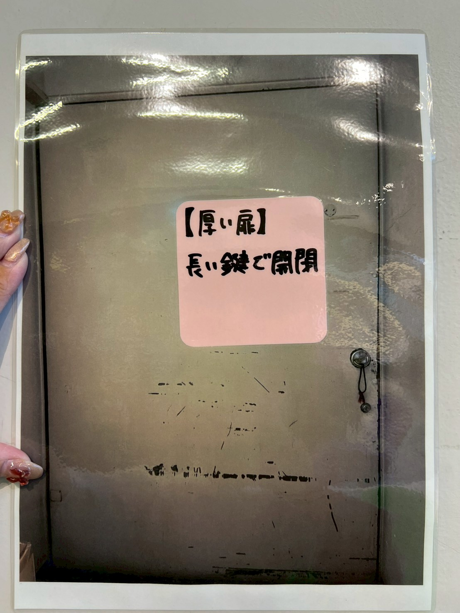

   - ボタンを押す場所
   
     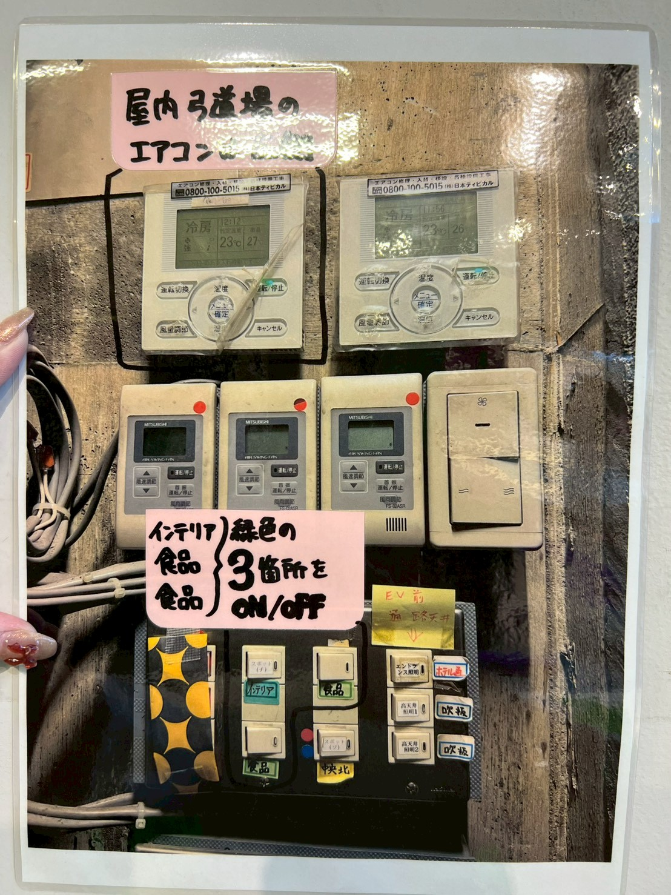
     
  - ここも忘れずに！

    　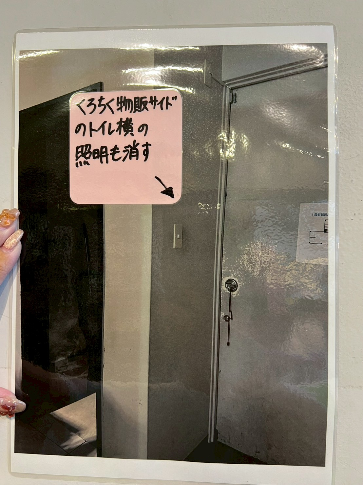
    
  2.4. 1階を警備状態に
  
  - この時にテナントの鍵が開いていると警報が鳴るので注意！
    
   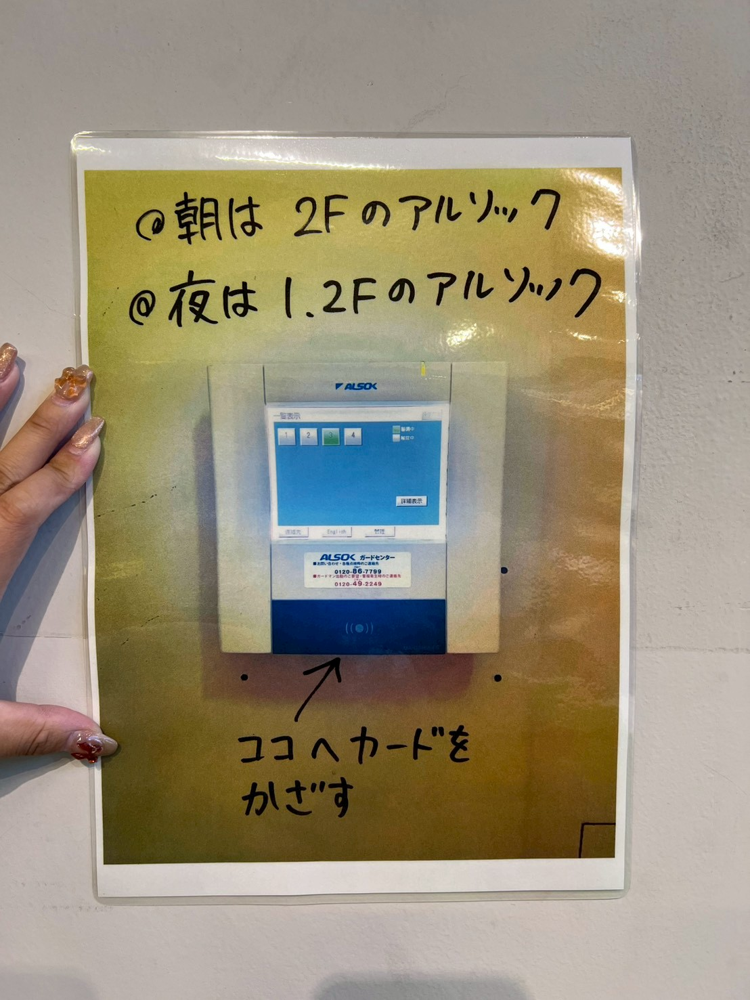
  
   - これ以降に電気の場所に行くとアルソックの警報が鳴るので注意！
   
4. ２階の電気を消す
   
   ２階にエレベーターで登ったら，
   
   2.1. 着替え
   
   2.2. レジ金をロッカーにしまい，鍵をかける

   - 該当のロッカー（レジ金ロッカーの鍵を使う）
    
   　
    
   2.3. タイムカードを切る
   
   2.4. ２階の電気を消す
   
   - 写真の場所から全ての電気，空調が消えるように電気を消す
     
     
     
   - こういう状態になればOK
     
     
     
   を行う

3. 最終締め作業
   
   3.1. アルソックで２階を警備状態に

   
   
   - 使ったカードと鍵を戻す（暗証番号も1234のままにしない）

   　

   3.2 外の自動ドアを閉める
   - 外のテナントにある長い棒を取り出す

     

   - 自動ドアのスイッチを押す

     🔻ここ
     
     

   　このボタン

    
   　
      
   
