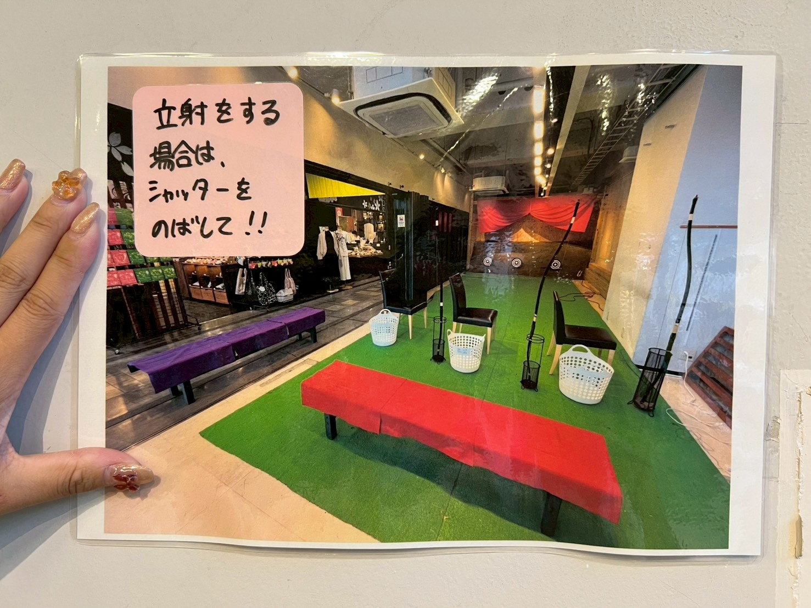
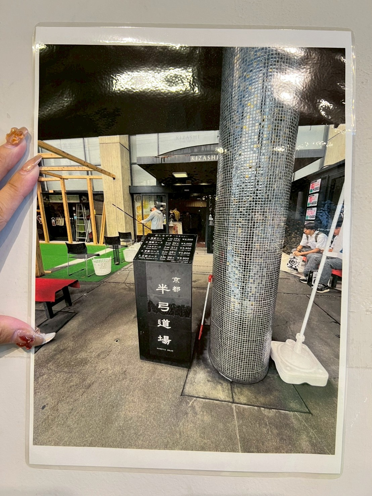
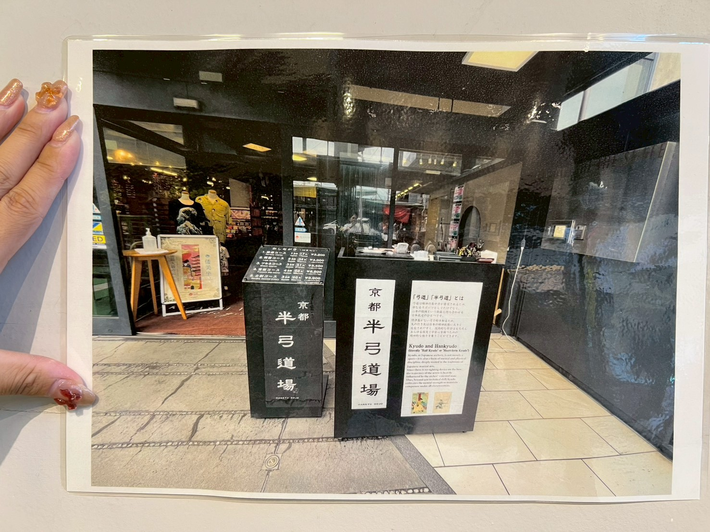
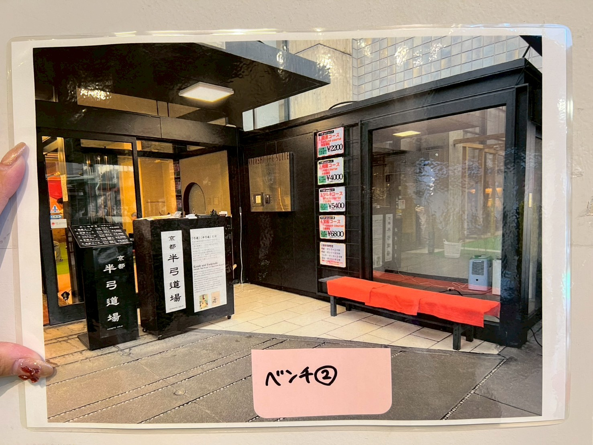

# 閉店作業
1. 一階中の締め作業   
   1.1. レジ締め（レジ点検）

   - タブレットのAirレジ（アプリ）を作動
   
       
   
   - ホームレジ中心の**レジ点検・清算**を押す
   
       
   
   - 上から三番目の**レジ点検・清算**を押す
   
       
   
   - 水色の**点検**を押す
   
       
      
   - 金種別に枚数を記録，過不足０であれば右下の**点検**を押す（問題があれば，風間さん，伊藤さんに相談する）
      
      

   - 日付，現金売り上げの金額，「半弓道場」と書いて売上金を茶封筒に入れる（間違っていた場合は再度確認，レジミスがなかったかを確認する）
   - 過不足金があった場合は日付，過剰金額，「半弓道場」を書いて過剰金を茶封筒に入れる
      
   3.3　中の準備

   - 写真のレイアウトのようになるように準備する
   
      
   
   - 安土側の電気をつける！
   
      
   
   3.4 外と中の準備

   - 晴れの日
  
      - 外と中の安土に水をかける
      - 写真のレイアウトのようになるように準備する

     レイアウト１
     
        

     レイアウト2
     
        

     - ベンチを設置する
        - 場所はガラスの前と自販機の横
          
       ベンチ１
     
        
       
     ベンチ２
     
        
1. アルソックの解除
   
   1.1. 出勤時，エレベータ前にあるカードとレジ金ロッカーの鍵を入手
   
　　
   
   - ダイヤルは**1,2,3,4**に設定する．
     
   
   
   
   　
   
   
   　　
   
   1.2. エレベーター右側のドアを開け，アルソックの機械にカードをかざす
   
   
   
   - これをしないとエレベーターが2階に行かない
   
   - 階段から登ると警報が出る
   
   のような問題が発生する
   
3. ２階の準備
   
   ２階にエレベーターで登ったら，
   
   2.1. 着替え
   
   2.2. レジ金をロッカーから取り出す

   - 該当のロッカー（レジ金ロッカーの鍵を使う）
    
   　
    
   2.3. タイムカードを切る
   
   2.4. ２階安土（的場の土）の水やり  
   
   を行う

5. 一階中の準備
   
   3.1. 照明・音楽・空調の準備

   エレベーター右側の通路から写真の該当の箇所の電源をONにする．
   
   - 電気をつける場所

   　

   - ボタンを押す場所
   
    

   - テナント（お店）を鍵を使って開ける
   
   3.2. レジ点検

   - タブレットのAirレジ（アプリ）を作動
   
       
   
   - ホームレジ中心の**レジ点検・清算**を押す
   
       
   
   - 上から三番目の**レジ点検・清算**を押す
   
       
   
   - 水色の**点検**を押す
   
       
      
   - 金種別に枚数を記録，過不足０であれば右下の**点検**を押す（問題があれば，風間さん，伊藤さんに相談する）
      
      
      
      
   3.3　中の準備

   - 写真のレイアウトのようになるように準備する
   
      
   
   - 安土側の電気をつける！
   
      
   
   3.4 外と中の準備

   - 晴れの日
  
      - 外と中の安土に水をかける
      - 写真のレイアウトのようになるように準備する

     レイアウト１
     
        

     レイアウト2
     
        

     - ベンチを設置する
        - 場所はガラスの前と自販機の横
          
       ベンチ１
     
        
       
     ベンチ２
     
        
4. 最終作業
   
   4.1. 照明・音楽・空調を消す
   
   - テナント（お店）を鍵を使って開ける
   
   - エレベーター右側の通路から写真の該当の箇所の電源をOFFにする．
   
   - 電気を消す場所

   　

   - ボタンを押す場所
   
    

  
   

