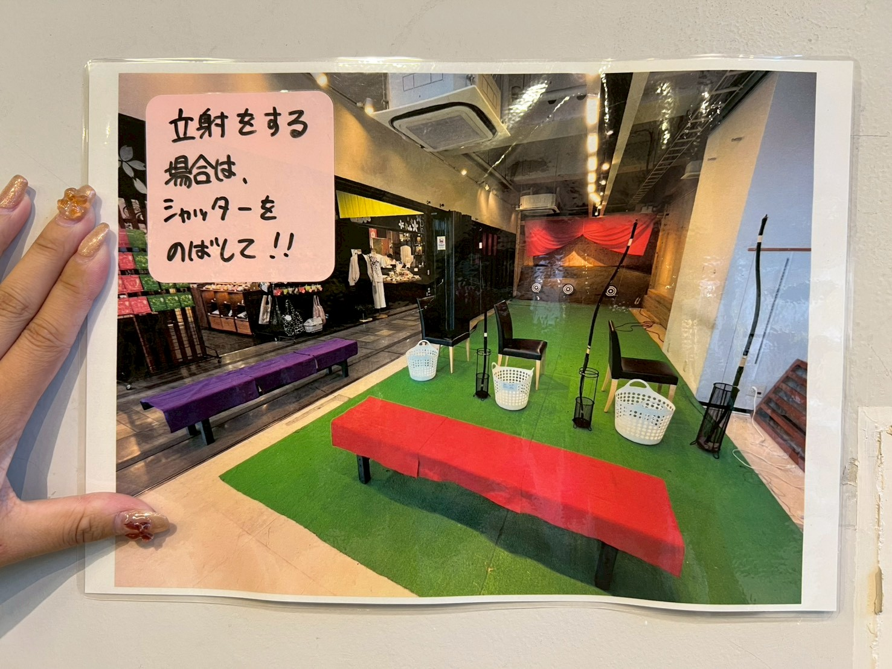
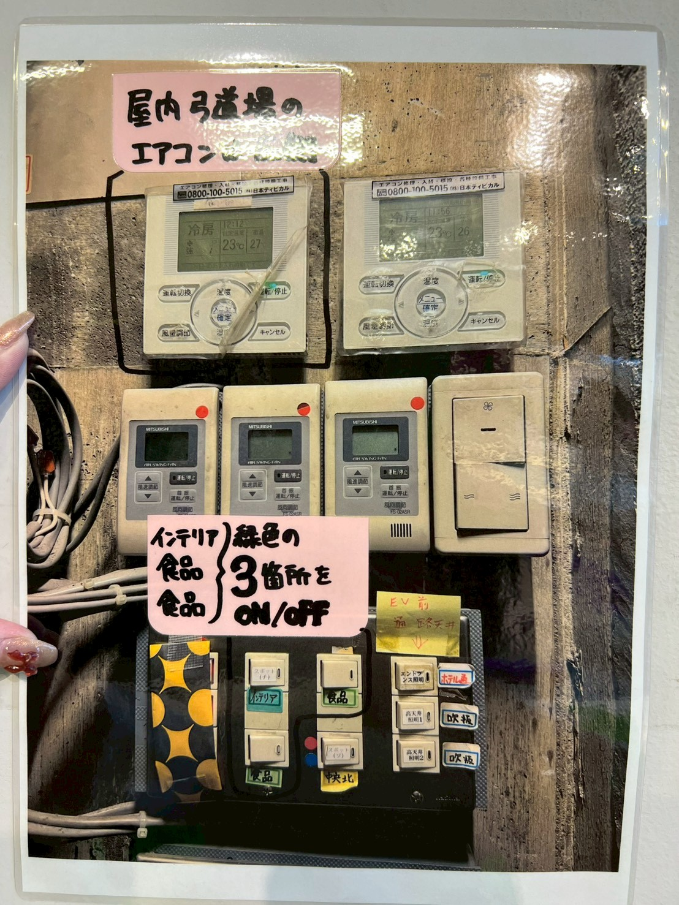
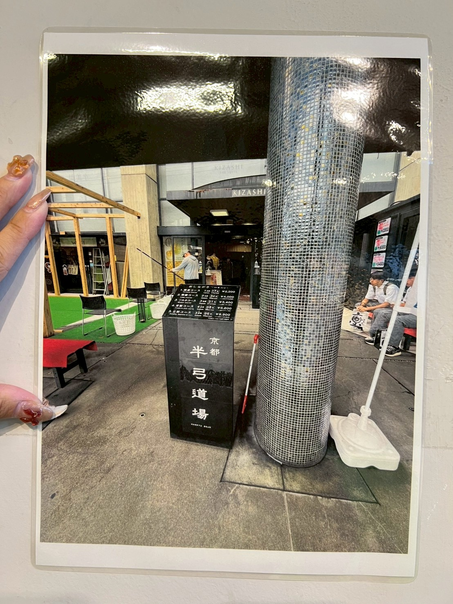
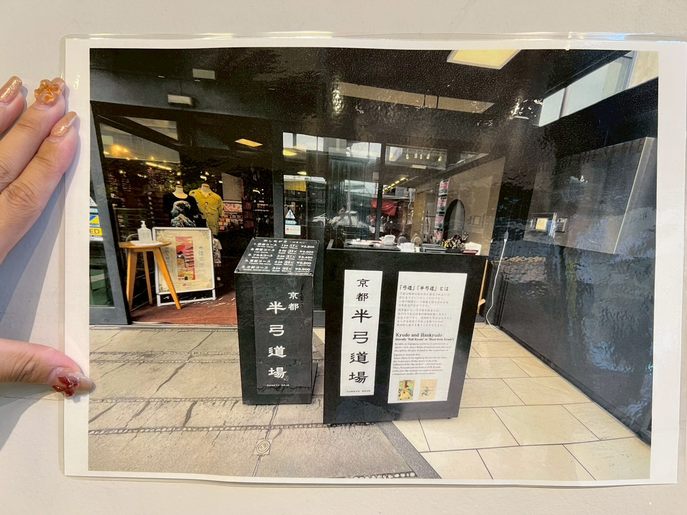
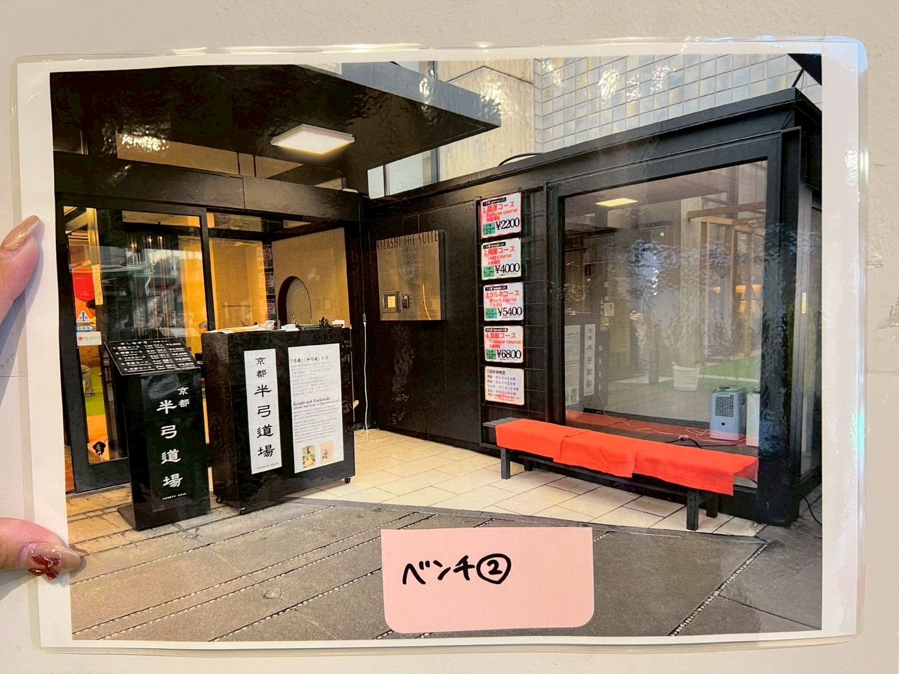
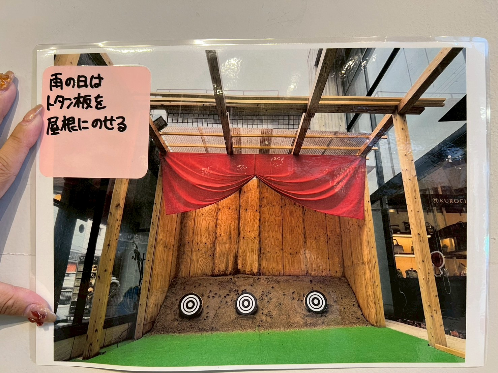
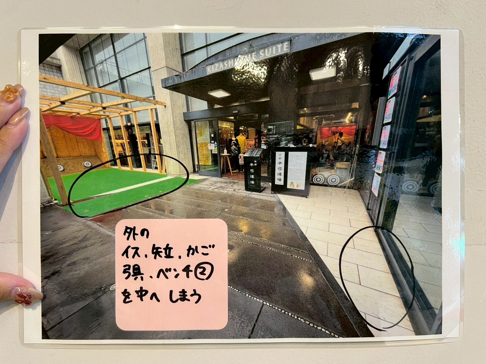

# 開店作業
## アルソックの解除
   
   1. 出勤時，エレベータ前にあるカードとレジ金ロッカーの鍵を入手
   
　　
   
   - ダイヤルは**1,2,3,4**に設定する．
     
   
   
   
   　
   
   
   　　
   
   2. エレベーター右側のドアを開け，アルソックの機械にカードをかざす
   
   
   
   - これをしないとエレベーターが2階に行かない
   
   - 階段から登ると警報が出る
   
   のような問題が発生する
   
## ２階の準備
   
   ２階にエレベーターで登ったら，
   
   1. 着替え
   
   2. レジ金をロッカーから取り出す

   - 該当のロッカー（レジ金ロッカーの鍵を使う）
    
   　
    
   3. タイムカードを切る
   
   4. ２階安土（的場の土）の水やり  
   
   を行う

 ##一階中の準備
   
   1. 照明・音楽・空調の準備

   エレベーター右側の通路から写真の該当の箇所の電源をONにする．
   
   - 電気をつける場所

   　

   - ボタンを押す場所
   
   

   - テナント（お店）を鍵を使って開ける
   
   2. レジ点検

   - タブレットのAirレジ（アプリ）を作動
   
       
   
   - ホームレジ中心の**レジ点検・清算**を押す
   
       
   
   - 上から三番目の**レジ点検・清算**を押す
   
       
   
   - 水色の**点検**を押す
   
       
      
   - 金種別に枚数を記録，過不足０であれば右下の**点検**を押す（問題があれば，風間さん，伊藤さんに相談する）
      
      
      
      
   3.　中の準備

   - 写真のレイアウトのようになるように準備する
   
      
   
   - 安土側の電気をつける！
   
      
   
   4. 外と中の準備

   - 晴れの日
  
      - 外と中の安土に水をかける
      - 写真のレイアウトのようになるように準備する

     レイアウト１
     
        

     レイアウト2
     
        

     - ベンチを設置する
        - 場所はガラスの前と自販機の横
          
       ベンチ１
     
        
       
     ベンチ２
     
        
     
   - 雨の日
     
      - 雨の日はトタン板を屋根に乗せる
        
      - ハシゴを使って上に置くこと
        
         
        
     - 外の椅子，矢立，かご，弓，ベンチ2は中にしまう
       
       　
         
